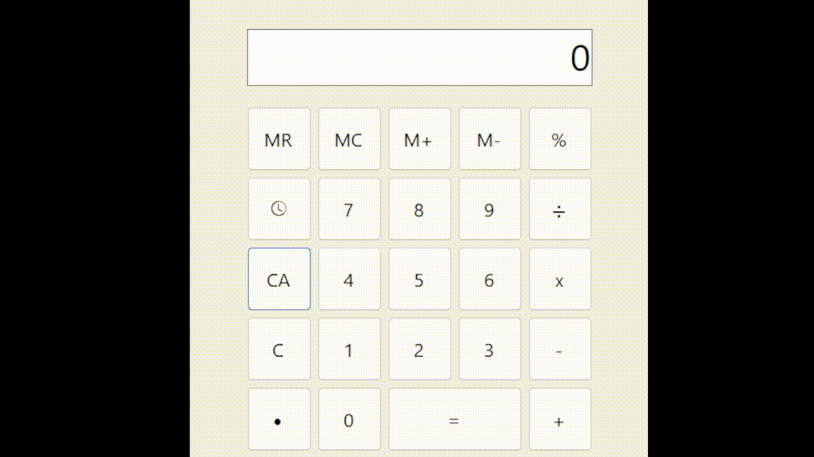

# Calculadora V3

## Funciones
- Operaciones ariméticas básicas
	- Suma
	- Resta
	- Multiplicación
	- División
- Funciones de borrado
	- Clear
	- Clear All
- Historial de operaciones
- Funciones de Memoria
	- M+
	- M-
	- MR
	- MC
- Función de porcentaje

